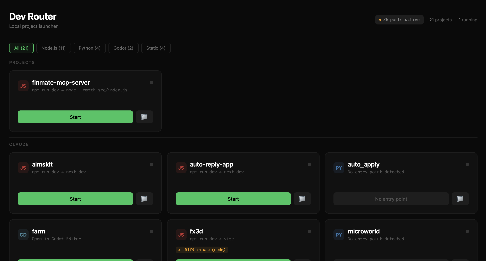

# Dev Router



One-click local dev server launcher. Scans your project folders, shows a dashboard, and lets you start/stop any project with a single click.


## Why

You have 10+ local projects. Each needs `npm run dev` or `python3 app.py`, each runs on a different port, and half the time port 3000 is already taken. Dev Router fixes this:

- **Auto-scan**: Point it at your project folders — it finds everything with a `package.json`, Python entry point, or `index.html`
- **One-click start**: Hit Start → it runs the dev command and opens your browser when ready
- **Port conflicts**: Detects occupied ports before starting. Offers to kill the blocking process or start anyway
- **Real-time logs**: View stdout/stderr for each running project
- **Zero config**: No database, no config files, no dependencies. Just `node server.js`

## Quick Start

```bash
git clone https://github.com/Angelov1314/dev-router.git
cd dev-router
node server.js
# → Dashboard opens at http://localhost:4000
```

By default, it scans the **parent directory** of wherever you cloned it. To scan custom directories:

```bash
# Scan multiple directories (comma-separated, optional label after colon)
DEV_ROUTER_DIRS="/Users/me/projects:Projects,/Users/me/work:Work" node server.js

# Change the dashboard port
DEV_ROUTER_PORT=8080 node server.js
```

Or edit `PROJECT_DIRS` directly in `server.js`.

## macOS Desktop App

Create a double-clickable `.app` on your Desktop:

```bash
bash create-app.sh
# → Creates "Dev Router.app" on Desktop
# → Double-click to launch dashboard + open browser
```

If you use nvm or a non-standard Node path:

```bash
bash create-app.sh ~/.nvm/versions/node/v22.0.0/bin/node
```

## Supported Project Types

| Type | How it's detected | Default Port |
|------|-------------------|-------------|
| **Next.js** | `next dev` in package.json scripts | 3000 |
| **Vite** | `vite` in scripts | 5173 |
| **Create React App** | `react-scripts` in scripts | 3000 |
| **Nuxt** | `nuxt` in scripts | 3000 |
| **Astro** | `astro` in scripts | 4321 |
| **Python (Flask)** | `app.py` or `server.py` with `requirements.txt` | 5000 |
| **Python (Django)** | `manage.py` with `requirements.txt` | 8000 |
| **Python (generic)** | `main.py` with `requirements.txt` | — |
| **Godot** | `project.godot` in root | — (opens editor) |
| **Static HTML** | `index.html` in root | — (opens file) |
| **Nested projects** | Subdirectory with its own `package.json` | auto-detected |

## How It Works

```
server.js (Node.js, zero dependencies)
├── Project scanner     — walks PROJECT_DIRS, detects type by files present
├── Process manager     — spawn/kill child processes, capture stdout/stderr
├── Port detection      — parses lsof output to find occupied ports
└── HTTP API            — serves dashboard + REST endpoints

index.html (single file, no build step)
├── Dashboard grid      — cards grouped by directory
├── Type filter tabs    — Node.js / Python / Godot / Static
├── Port conflict modal — Kill & Start / Start Anyway / Cancel
└── Log viewer modal    — real-time scrolling output
```

## API

All endpoints are on `http://localhost:4000` (or your custom port).

| Endpoint | Method | Body | Description |
|----------|--------|------|-------------|
| `/api/status` | GET | — | All projects with state, ports, conflicts |
| `/api/ports` | GET | — | All occupied TCP ports on system |
| `/api/start` | POST | `{ name, forceStart? }` | Start a project's dev server |
| `/api/stop` | POST | `{ name }` | Stop a running project |
| `/api/kill-port` | POST | `{ port }` | Kill whatever process holds a port |
| `/api/logs?name=` | GET | — | Log output for a running project |
| `/api/folder` | POST | `{ path }` | Open folder in system file manager |

## License

MIT
